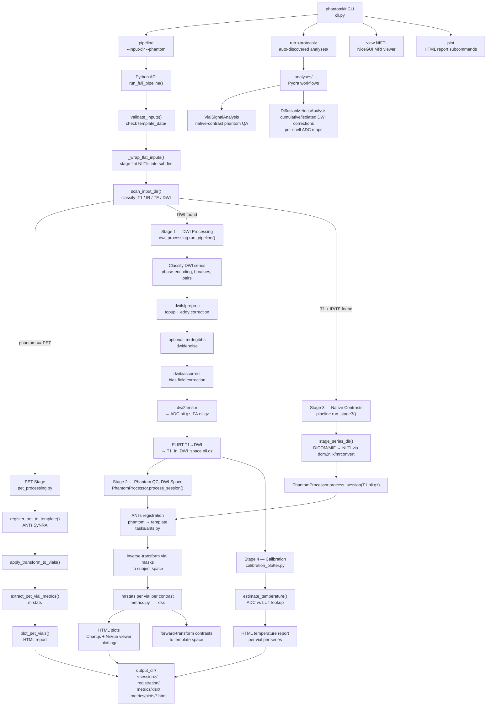

```mermaid
flowchart TD
    %% ── Entry Points ──────────────────────────────────────────────────────────
    CLI["phantomkit CLI<br/>cli.py"]
    PY["Python API<br/>run_full_pipeline()"]

    CLI --> CMD_PIPELINE["pipeline<br/>--input-dir --phantom"]
    CLI --> CMD_RUN["run &lt;protocol&gt;<br/>auto-discovered analyses/"]
    CLI --> CMD_VIEW["view NIFTI<br/>NiceGUI MRI viewer"]
    CLI --> CMD_PLOT["plot<br/>HTML report subcommands"]

    CMD_PIPELINE --> PY
    PY --> VALIDATE["validate_inputs()<br/>check template_data/"]
    VALIDATE --> WRAP["_wrap_flat_inputs()<br/>stage flat NIfTIs into subdirs"]
    WRAP --> SCAN["scan_input_dir()<br/>classify: T1 / IR / TE / DWI"]

    %% ── PET fork ──────────────────────────────────────────────────────────────
    SCAN -->|phantom == PET| PET_STAGE["PET Stage<br/>pet_processing.py"]
    PET_STAGE --> PET_REG["register_pet_to_template()<br/>ANTs SyNRA"]
    PET_REG --> PET_VIALS["apply_transform_to_vials()"]
    PET_VIALS --> PET_METRICS["extract_pet_vial_metrics()<br/>mrstats"]
    PET_METRICS --> PET_HTML["plot_pet_vials()<br/>HTML report"]

    %% ── MRI fork ──────────────────────────────────────────────────────────────
    SCAN -->|DWI found| S1["Stage 1 — DWI Processing<br/>dwi_processing.run_pipeline()"]
    SCAN -->|T1 + IR/TE found| S3["Stage 3 — Native Contrasts<br/>pipeline.run_stage3()"]

    %% Stage 1 internals
    S1 --> DWI_CLASSIFY["Classify DWI series<br/>phase-encoding, b-values, pairs"]
    DWI_CLASSIFY --> DWI_PREPROC["dwifslpreproc<br/>topup + eddy correction"]
    DWI_PREPROC --> DWI_DEGIBBS["optional: mrdegibbs<br/>dwidenoise"]
    DWI_DEGIBBS --> DWI_BIAS["dwibiascorrect<br/>bias field correction"]
    DWI_BIAS --> DWI_TENSOR["dwi2tensor<br/>→ ADC.nii.gz, FA.nii.gz"]
    DWI_TENSOR --> DWI_T1REG["FLIRT T1→DWI<br/>→ T1_in_DWI_space.nii.gz"]

    %% Stage 2
    DWI_T1REG --> S2["Stage 2 — Phantom QC, DWI Space<br/>PhantomProcessor.process_session()"]

    %% Stage 3 internals
    S3 --> STAGE_NII["stage_series_dir()<br/>DICOM/MIF → NIfTI via dcm2niix/mrconvert"]
    STAGE_NII --> S3_PROC["PhantomProcessor.process_session(T1.nii.gz)"]

    %% PhantomProcessor shared internals
    S2 --> ANTS_REG
    S3_PROC --> ANTS_REG["ANTs registration<br/>phantom → template<br/>tasks/ants.py"]
    ANTS_REG --> VIAL_XFORM["inverse-transform vial masks<br/>to subject space"]
    VIAL_XFORM --> MRSTATS["mrstats per vial per contrast<br/>metrics.py → .xlsx"]
    MRSTATS --> PLOTS["HTML plots<br/>Chart.js + NiiVue viewer<br/>plotting/"]
    MRSTATS --> FWD_XFORM["forward-transform contrasts<br/>to template space"]

    %% Stage 4
    DWI_T1REG --> S4["Stage 4 — Calibration<br/>calibration_plotter.py"]
    S4 --> TEMP_EST["estimate_temperature()<br/>ADC vs LUT lookup"]
    TEMP_EST --> CAL_HTML["HTML temperature report<br/>per vial per series"]

    %% Auto-discovered analyses
    CMD_RUN --> ANALYSES["analyses/<br/>Pydra workflows"]
    ANALYSES --> VSA["VialSignalAnalysis<br/>native-contrast phantom QA"]
    ANALYSES --> DMA["DiffusionMetricsAnalysis<br/>cumulative/isolated DWI corrections<br/>per-shell ADC maps"]

    %% Outputs
    PLOTS --> OUT["output_dir/<br/>&nbsp;&nbsp;&lt;session&gt;/<br/>&nbsp;&nbsp;&nbsp;&nbsp;registration/<br/>&nbsp;&nbsp;&nbsp;&nbsp;metrics/xlsx/<br/>&nbsp;&nbsp;&nbsp;&nbsp;metrics/plots/*.html"]
    CAL_HTML --> OUT
    PET_HTML --> OUT
```
